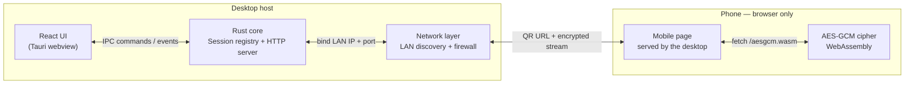
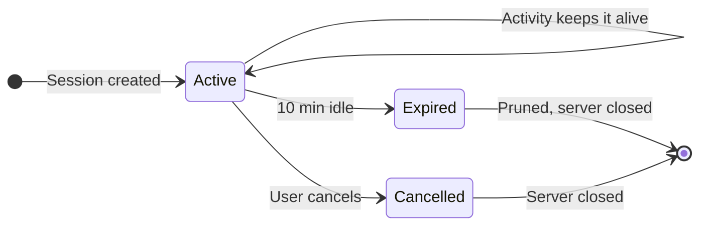

# AirLynk

> LAN file transfer, wrapped in a tamper-evident sleeve.

AirLynk is a desktop app that moves files between a PC and any phone **on the same Wi-Fi network** — no accounts, no cloud, no cables, and **no phone app required**. The phone just scans a QR code and uses its browser.

Every byte crossing the network is encrypted end-to-end with **AES-256-GCM**, and the session key travels only inside the QR code itself — it is never sent to the server, never logged, and never stored.


---

## Highlights

- **No phone app.** The desktop serves a fully self-contained mobile page plus a WebAssembly cipher module over the LAN; any phone browser works.
- **End-to-end encryption.** Files are chunk-encrypted with AES-256-GCM before they leave the device, in both directions.
- **QR pairing.** Scan a QR to join a session; verify with an unambiguous `XX-XX` display code shown on both devices.
- **Both directions.** Send files from the PC to the phone, or from the phone to the PC.
- **Multi-gigabyte files.** Streams with bounded memory — files are never buffered whole.
- **Smart LAN discovery.** Picks the real adapter and filters virtual ones (VPNs, WSL, Hyper-V, Docker, …), so the QR code always points somewhere reachable.
- **First-run wizard.** Checks network reachability and Windows Firewall, and can repair the required allow rule.
- **Upload safety.** In-flight uploads land in a quarantine folder, are decrypted and authenticated before release, never overwrite existing files, and hostile filenames are sanitized.

---

## How it works

When a session starts, the desktop binds a small HTTP server to its LAN address on an ephemeral port (never `0.0.0.0`). The phone reaches it by scanning the QR code, which encodes the URL **plus the AES-256 session key in the URL fragment** — the fragment is never transmitted to the server, so the key stays between the two devices.



The cipher is one Rust crate, compiled twice: natively for the desktop and to `wasm32` for the phone. Both implementations are pinned against each other byte-for-byte by a cross-check script, so a phone can never disagree with the desktop about a single byte.

### Send: PC → phone

```mermaid
sequenceDiagram
    autonumber
    participant U as User
    participant A as Desktop app
    participant R as Rust backend
    participant P as Phone browser

    U->>A: Pick files to send
    A->>R: start_send_session(files)
    R->>R: Create session, AES-256 key, XX-XX code
    R-->>A: token + display code
    A-->>U: Show QR label (key in URL fragment)
    U->>P: Scan QR
    P->>R: GET /s/&lt;token&gt; — file listing
    R-->>P: File list + base nonce
    P->>P: Load AES-GCM wasm module
    P->>R: GET /s/&lt;token&gt;/f/&lt;id&gt; — encrypted stream
    R-->>P: Framed AES-GCM chunks (streamed, flat memory)
    P->>P: Decrypt chunk-by-chunk, reassemble
    P-->>U: Save file
```

### Receive: phone → PC

```mermaid
sequenceDiagram
    autonumber
    participant U as User
    participant A as Desktop app
    participant R as Rust backend
    participant P as Phone browser

    U->>A: Start a receive session
    A->>R: start_receive_session()
    R->>R: Create session, AES-256 key, XX-XX code
    R-->>A: token + display code
    A-->>U: Show QR label (key in URL fragment)
    U->>P: Scan QR
    P->>R: GET /r/&lt;token&gt; — upload page
    P->>P: Encrypt selected files in wasm
    P->>R: POST /r/&lt;token&gt; — encrypted multipart upload
    R->>R: Quarantine, decrypt, authenticate, verify
    R-->>P: Per-file result (done / failed)
    R->>R: Move verified files into Downloads
    R-->>A: session-delivered event
    A-->>U: Progress + result
```

---

## Security model

| Concern | How AirLynk handles it |
| --- | --- |
| Session identity | 256-bit CSPRNG token, URL-safe base64, compared in constant time |
| Session key | 256-bit, generated by the OS CSPRNG; travels **only** in the QR URL fragment |
| Human verification | 4-character display code from an unambiguous alphabet (no `0/O/1/I/L`), collision-checked, rendered identically on both devices |
| Transport | AES-256-GCM per 1 MiB chunk; per-chunk authentication tag; nonce derived from session base + chunk index |
| Wire exposure | Plaintext never appears on the wire — a flipped byte fails authentication, not decryption |
| Network exposure | Server binds only to the discovered LAN address, never `0.0.0.0` |
| Expiry | Sessions auto-expire after 10 minutes of inactivity and are pruned, closing the server with the last one |
| Upload caps | 500 files / 64 GiB per session, enforced atomically even under concurrent uploads |
| Path safety | Filenames sanitized (no `..` traversal); name collisions get a ` (1)` suffix instead of overwriting |
| Tampered uploads | Quarantined first; rejected ciphertext leaves no file behind |
| Unknown tokens | Indistinguishable 404 for missing, expired, or wrong-kind sessions |

Sessions live in a registry owned entirely by the Rust backend; the webview holds display state only.



> **Threat model:** AirLynk protects against passive sniffing on the LAN. An active man-in-the-middle is documented accepted risk — chunk integrity is per-chunk, so reordering and dropping are out of scope by design.

---

## Tech stack

| Layer | Technology |
| --- | --- |
| Desktop shell | [Tauri 2](https://tauri.app) (frameless, transparent window with Mica effect) |
| Frontend | React 19 · TypeScript 5.8 · Vite 7 · Tailwind CSS 4 · Framer Motion |
| Backend | Rust (tokio + axum) embedded HTTP server |
| Crypto | `airlynk-crypto` — AES-256-GCM chunked streaming, native **and** `wasm32` |
| Phone client | Self-contained mobile page + WebAssembly cipher, served from the desktop |
| Platform | Windows (firewall integration, WebView2) |

---

## Repository layout

```
airlynk/
├── src/                      # React UI (Tauri webview)
│   ├── components/           # Sleeve, SealBand, VoidWash, LabelFace, FirstRun wizard
│   ├── hooks/                # drag-drop, keyboard, reduced-motion
│   └── lib/                  # IPC bridge, tokens, state machine, mock data
├── src-tauri/                # Rust desktop backend (Tauri 2)
│   ├── src/
│   │   ├── server/           # axum HTTP server: pages, download, upload, assets
│   │   ├── session.rs        # session registry: tokens, keys, caps, expiry
│   │   ├── net.rs            # LAN IPv4 discovery (filters virtual adapters)
│   │   ├── firewall.rs       # Windows Firewall check / repair
│   │   ├── safety.rs         # filename sanitization, quarantine handling
│   │   └── server_manager.rs # server lifecycle
│   └── build.rs              # compiles the wasm cipher into the binary
├── crates/airlynk-crypto/    # AES-256-GCM chunked cipher (native + wasm32)
├── scripts/                  # native ↔ wasm byte-for-byte cross-check
├── installer/                # firewall helper script (bundled)
└── public/                   # static assets
```

---

## Getting started

### Prerequisites

- [Node.js](https://nodejs.org) 20+
- [Rust](https://rustup.rs) (stable)
- Tauri 2 prerequisites for Windows — [WebView2](https://developer.microsoft.com/en-us/microsoft-edge/webview2/) and the MSVC build tools
- The `wasm32-unknown-unknown` Rust target (needed to compile the phone cipher):

```bash
rustup target add wasm32-unknown-unknown
```

### Run in development

```bash
npm install
npm run tauri dev
```

### Build an installer

```bash
npm run tauri build
```

The build compiles the desktop app **and** the `wasm32` cipher, then embeds `aesgcm.wasm` into the binary via `build.rs` — the phone client is always served from inside the app, never fetched from the internet.

### Tests

```bash
cargo test --workspace          # unit + integration tests (Rust)
node scripts/wasm-cross-check.mjs  # native ↔ wasm cipher agreement
```

The native ↔ wasm cross-check requires a fixture generated by the native build and the wasm artifact; run it after any change to `airlynk-crypto`:

```bash
cargo test -p airlynk-crypto print_wasm_fixture
cargo build -p airlynk-crypto --target wasm32-unknown-unknown --release --target-dir target-wasm
node scripts/wasm-cross-check.mjs
```

A multi-gigabyte flat-memory exit-criteria test is included but deliberately ignored for normal runs:

```bash
cargo test -p airlynk -- --ignored
```

---

## Status

AirLynk is at **v0.1.0**. The end-to-end encrypted send and receive flows work over a real LAN; the UI metaphor — a tamper-evident sleeve that seals around a transfer — is in place, and the phone pages are functional shells on the way to their full experience.
